目录：

- <a href= "#title2">BPM ZT Kafka 接入</a>
    - <a href="#title2_sub1">1.Kafka 工作原理</a>
    - <a href="#title2_sub1">2.Spring Kafka 介绍</a>
    - <a href="#title2_sub1">3.ZT kafka封装包的设计及使用</a>

# <a id="title2" name="title2"></a>BPM ZT Kafka 接入

## <a id="title2_sub1" name="title2_sub1"></a> 1.Kafaka 工作原理

## 1).kafka 的定义：

### 消息队列的两种模式：
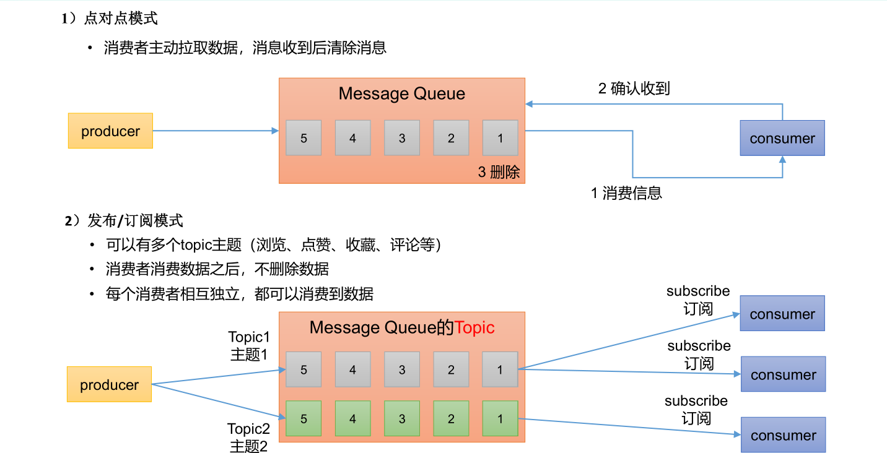
1).点对点模式（一对一，消费者主动拉取数据，消息收到后消息清除）
点对点模型通常是一个基于拉取或者轮询的消息传送模型，这种模型从队列中请求信息，
而不是将消息推送到客户端。这个模型的特点是发送到队列的消息被一个且只有一个接收者
接收处理，即使有多个消息监听者也是如此。

2).发布/订阅模式（一对多，数据生产后，推送给所有订阅者）
发布订阅模型则是一个基于推送的消息传送模型。发布订阅模型可以有多种不同的订阅
者，临时订阅者只在主动监听主题时才接收消息，而持久订阅者则监听主题的所有消息，即
使当前订阅者不可用，处于离线状态。

### Kafka 的基本介绍：

1).Apache Kafka 是一个开源消息系统，由 Scala 写成。是由 Apache 软件基金会开发的 一个开源消息系统项目。

2).Kafka 最初是由 LinkedIn 公司开发，并于 2011 年初开源。2012 年 10 月从 Apache Incubator 毕业。该项目的目标是为处理实时数据提供一个统一、高通量、低等待的平台。

3).Kafka 是一个分布式消息队列。Kafka 对消息保存时根据 Topic 进行归类，发送消息 者称为 Producer，消息接受者称为 Consumer，此外 kafka 集群有多个 kafka 实例组成，每个 实例(server)
称为 broker。

### 传统定义：

kafka 是一个分布式基于发布/订阅模式的消息队列（Messge Queue)，主要用于大数据实时处理领域。

发布/订阅： 消息的发布不会将消息直接发送给特定的订阅者，而是将发布的消息分为不同的类别，订阅者只接收感兴趣的消息。

### 最新的定义：

kafka 是一个开源的分布式事件流平台（Event Streaming Platform），被数千件公司用于高性能数据管道、流分析、 数据集成和关键人任务应用。

### 2).kafka 的应用场景：

### 缓存/消峰：有助于控制和优化数据流经过系统的速度，解决生产消息和消费消息的处理速度不一致的情况。
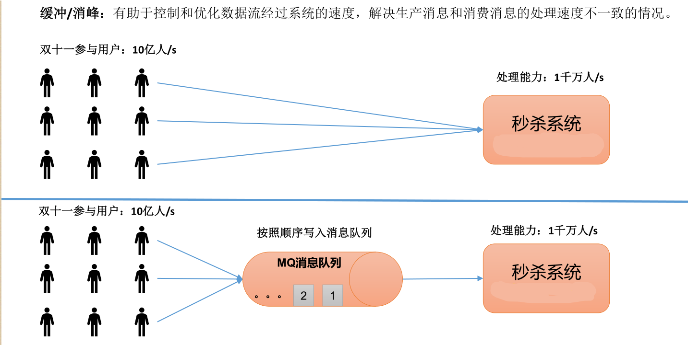

### 解耦： 允许你独立的扩展或修改两边的处理过程，只要确保它们遵守同样的接口约束。
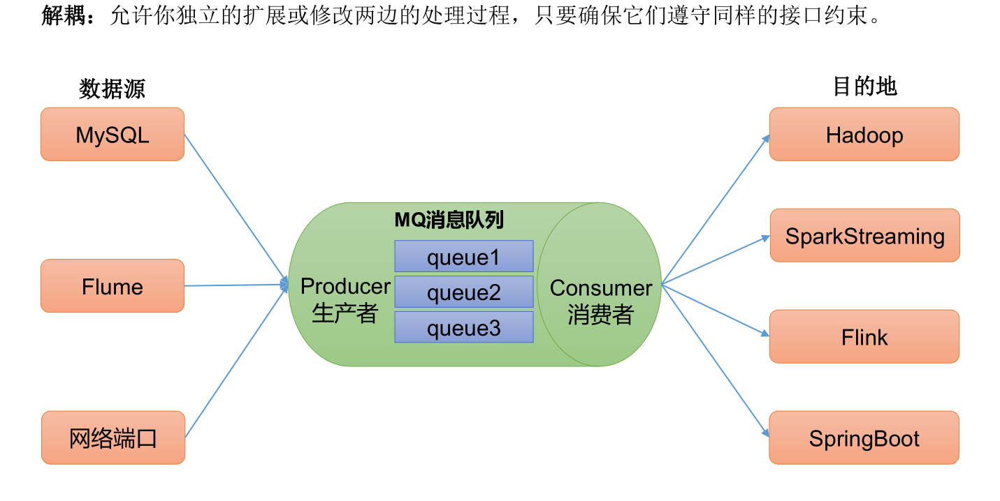

### 异步通信：
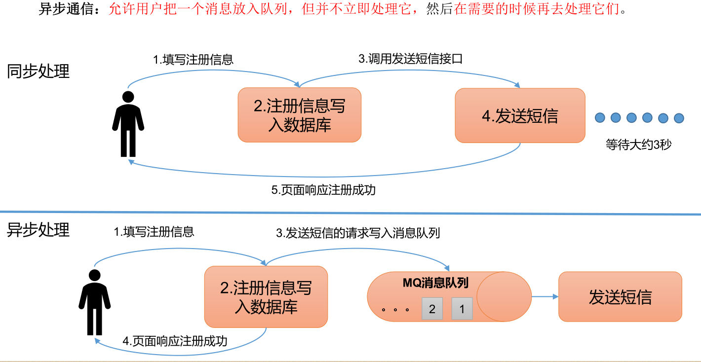

## 3).kafka 的组成：

### 基础架构：

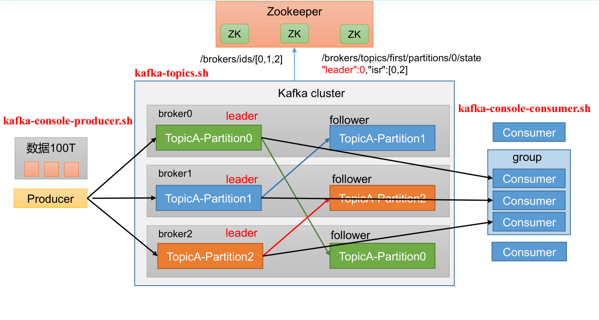

1).Producer ：消息生产者，就是向 Kafka broker发消息的客户端。

2).Consumer ：消息消费者，向 Kafka broker 取消息的客户端。

3).Consumer Group （CG ）：消费者组，由多个 consumer组成。 消费者组内每个消费者负责消费不同分区的数据，一个分区只能由一个 组内 消费者消费；消费者组之间互不影响。所有的消费者都属于某个消费者组，即
消费者组是逻辑上的一个订阅者。

4).Broker ：一台 Kafka 服务器就是一个 broker。一个集群由多个 broker 组成。一个broker可以容纳多个 topic。

5).Topic：可以理解为一个队列，个 生产者和消费者面向的都是一个 topic。

6).Partition ：为了实现扩展性，一个非常大的 topic 可以分布到多个 broker（即服务器）上，个 一个 topic 可以分为多个 partition，每个 partition 是一个有序的队列。
partions主题分区数:kafka通过分区策略，将不同的分区分配在一个集群中的broker上，一般会分散在不同的broker上，当只有一个broker时，所有的分区就只分配到该Broker上。
消息会通过负载均衡发布到不同的分区上，消费者会监测偏移量来获取哪个分区有新数据，从而从该分区上拉取消息数据。分区数越多，在一定程度上会提升消息处理的吞吐量;

7).Replica ：副本,一个 topic 的每个分区都有若干个副本，一个 Leader 和若干个 Follower。

8).Leader ：每个分区多个副本的“主”，生产者发送数据的对象，以及消费者消费数据的对象都是 Leader。

9).Follower ：每个分区多个副本中的“从”，实时从 Leader 中同步数据，保持和Leader 数据的同步。Leader 发生故障时，某个 Follower 会成为新的 Leader。

10).Offset: 消息位移,表示分区中每条消息的位置信息，是一个单调递增且不变的值

11).Consumer Offset：消费者位移，表征消费者消费进度，每个消费者都有自己的消费者位移。

### 生产者发送流程：

在消息发送的过程中，涉及到了两个线程 ——main 线程和 Sender 线程。在main线程中创建了一个双端队列 
RecordAccumulator。main线程将消息发送给 RecordAccumulator，
Sender线程不断从 RecordAccumulator 中拉取消息发送到 Kafka Broker。

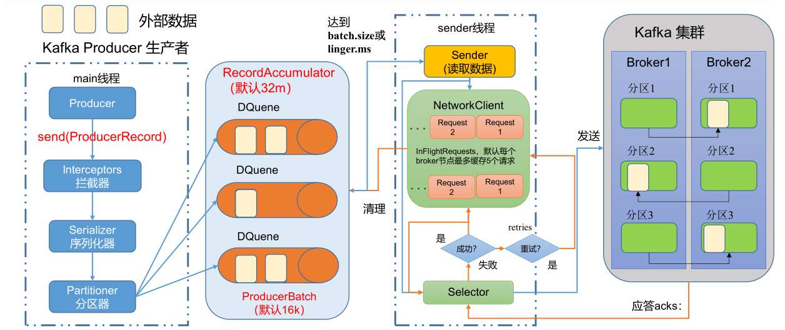

* 1）producer 先从 zookeeper 的 "/brokers/.../state"节点找到该 partition 的 leader
* 2）producer 将消息发送给该 leader
* 3）leader 将消息写入本地 log
* 4）followers 从 leader pull 消息，写入本地 log 后向 leader 发送 ACK
* 5）leader 收到所有 ISR 中的 replication 的 ACK 后，增加 HW（high watermark，最后 commit
  的 offset）并向 producer 发送 ACK

• batch.size ：只有数据积累到batch.size之后，sender才会发送数据。默认16k

• linger.ms ：如果数据迟迟未达到batch.size，sender等待linger.time之后就会 发送数据。单位ms，默认值是0ms，表示没有延迟。


### acks 应答级别：

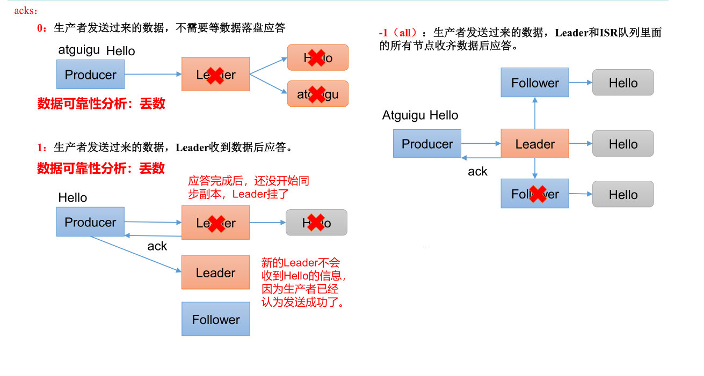

acks=0，生产者发送过来数据就不管了，可靠性差，效率高；
acks=1，生产者发送过来数据Leader 应答，可靠性中等，效率中等；
acks=-1，生产者发送过来数据Leader 和ISR 队列里面所有Follwer 应答，可靠性高 ，效率低；

> 在生产环境中， acks=0 很少使用；acks=1， 一般用于传输普通日志 ， 允许丢个别数据；acks=-1，一般用于传输和钱相关的数据，对可靠性要求比较高的场景 。

> 数据完全可靠条件：ACK 级别设置为-1 + 分区副本大于等于2 + ISR 里应答的的最小副本数量大于等于2

### 消费者：

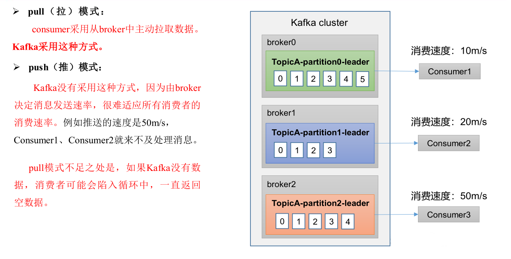

消费者组定义：消费者使用一个消费者组名（即group.id）来标记自己，topic的每条消息都只会被发送到每个订阅它的消费者组的一个消费者实例上

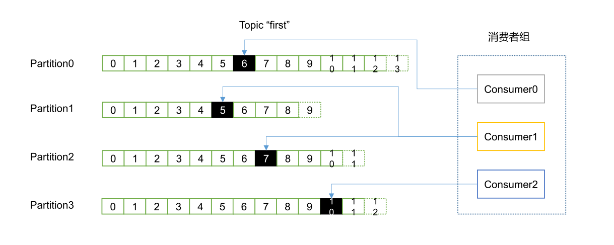
> 一个consumer group可能有若干个consumer实例
> 对于同一个group而言，topic的每条消息只能被发送到group下的一个consumer实例上
> topic消息可以被发送到多个group中

Kafka同时支持基于队列和基于发布/订阅的两种消息引擎模型，事实上Kafka是通过consumer group实现对这两种模型的支持

> 所有consumer实例都属于相同group—实现基于队列的模型，每条消息只会被一个consumer实例处理
> consumer实例都属于不同group—实现基于发布/订阅的模型，极端的情况是每个consumer实例都设置完全不同都group，这样kafka消息就会被广播到所有consumre实例

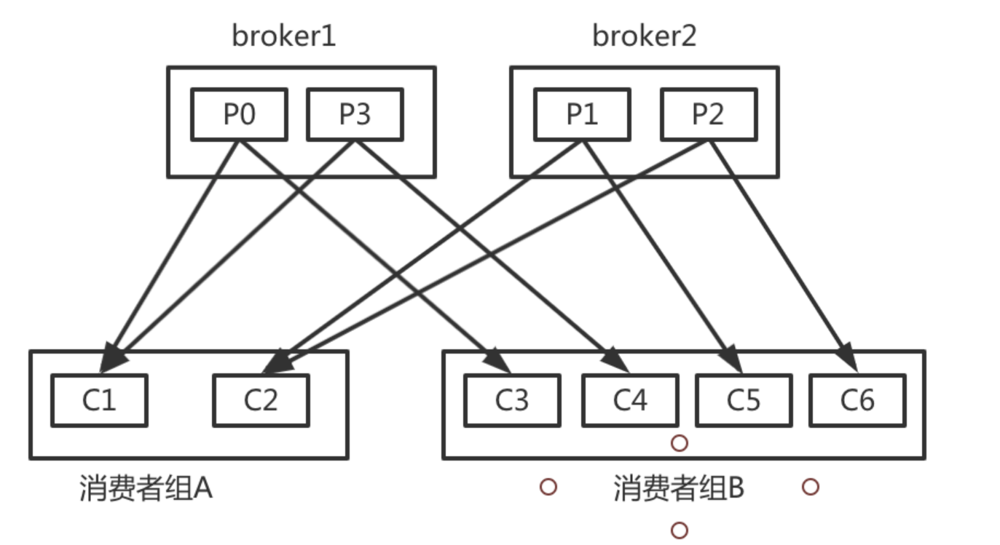

### 消费者工作流程：

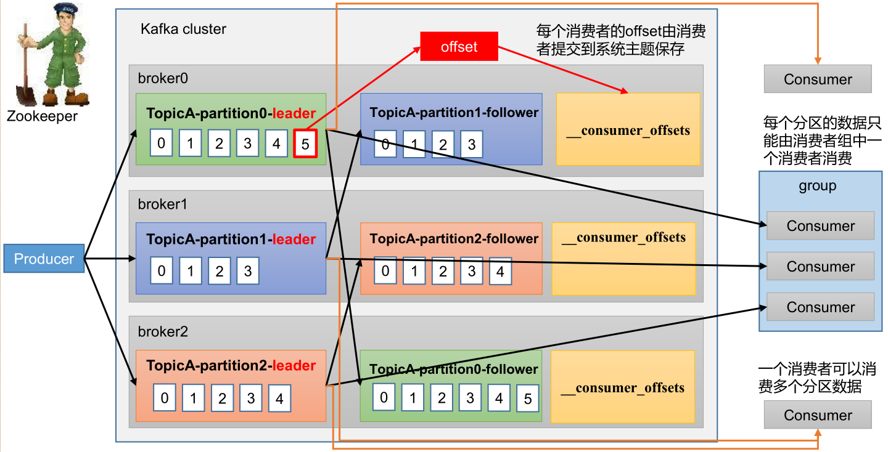

consumer需要同时读取多个topic的多个分区消息，若实现并行的消息读取，一种方式是使用多线程，为每个要读取的分区创建一个专有线程去消费，旧版本consumer就是使用这种方式；另一种方式类似于Linux
I/O模型的poll或select，使用一个线程来同时管理多个socket连接，即同时与多个broker实现消息的并行消费，新版本consumer采用这种设计

一旦consumer订阅了topic，所有消费逻辑包括coordinator的协调、消费者组的rebalance以及数据的获取都会在主逻辑poll方法的一次调用中被执行，这样用户很容易使用一个线程来管理consumer I/O操作

对于新版本consumer Kafka
1.0.0而言，是一个双线程Java进程，创建KafkaConsumer的线程被称为用户主线程，同时consumer在后台会创建一个心跳线程。KafkaConsumer的poll方法在用户主线程中运行，这也表明消费者组rebalance、
消息获取、coordinator管理、异步任务结果的处理甚至位移提交等操作都运行在用户主线程中

### 漏消费和重复消费：

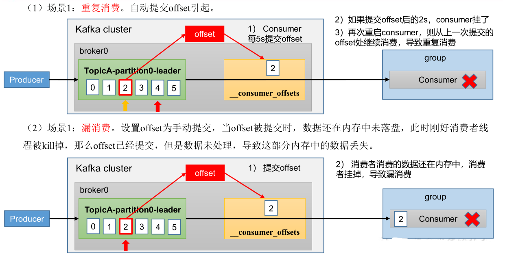


## <a id="title2_sub1" name="title2_sub1"></a> 2.Spring Kafka 介绍

### 引入依赖：

``` build.gradle
  implementation'org.springframework.kafka:spring-kafka'
  testImplementation'org.springframework.kafka:spring-kafka-test'
```

### spring-kafka 的主要参数配置及说明：

```yaml
spring:
  kafka:
    #kafka 服务地址，可以有多个用,隔开
    bootstrap-servers:localhost: 9002
    # 消費者监听得的topic 不存在时项目启动不报错
    listener.missinng-topics-fatal: false
    # 在监听容器中运行的线程数：
    listener.concurrency: 10
    # 轮询超时时间：
    listener.pol.timeout: 5000

    # 生产者参数
    producer:
      # 消息发送重试次数
      retries: 0
      # 一个批次可以使用的内存大小：
      batch-size: 16384
      # 设置生产者内存缓存大小：
      buffer-memory: 33554432
      # 同步副本机制：
      acks: 1
      key-serializer: org.apache.kafka.common.serialization.StringSerializer
      value-serializer: org.apache.kafka.common.serialization.StringSerializer

    consumer:
      group-id:
      # 一次调用poll 返回的最大记录数
      max-poll-recode: 500
      # 是否自动提交偏移量，2.1版本后面默认值为 false ,为了避免出现重复数据和数据丢失，可以把他设置为 false,然后手动提交偏移量
      enable-auto-commmit: false
      # 自动提交的时间间隔： 在spring boot 2.x 版本是值的类型为 Duration 需要符合特定的格式，如1S，1M，2H，5D, enable-auto-commit 为false 情况下该参数不生效
      auto-commit-interval: 1S
      # 该属性指定了消费者在读取一个没有偏移的分区或者偏移量无效的情况下该作何处理：
      # earliest:当各分区下有已提交的offset时，从提交的offset开始消费；无提交的offset时，从头开始消费
      # latest:当各分区下有已提交的offset时，从提交的offset开始消费；无提交的offset时，消费新产生的该分区下的数据 默认值
      # none:topic各分区都存在已提交的offset时，从offset后开始消费；只要有一个分区不存在已提交的offset，则抛出异常
      auto-offset-reset: earliest
      # 返回的最小字节数，默认为1
      fetch-min-size: 1
      # 最长阻塞时间：
      fetch-max-wait: 500
      #消费者进程 id 
      client-id: 1
      key-serializer: org.apache.kafka.common.serialization.StringSerializer
      value-serializer: org.apache.kafka.common.serialization.StringSerializer

```

### Configuring Topics

如果你在应用上下文中定义了一个KafkaAdmin的bean,它可以自动向代理添加主题，只需要向每个主题添加NewTopic的bean在应用中的上下文：

```java
@Bean
public KafkaAdmin admin(){
        Map<String, Object>  configs=new HashMap();
        configs.put(AdminClientConfig.BOOTSTRAP_SERVER_CONFIG,"localhost:9092");
        reture new KafkaAdmin(configs);
        }

@Bean
public NewTopic topic1(){
        return TopicBuilder.name("topic1")
        .partition(1)
        .replicas(1)
        .build();
        }

```

在springBoot 项目中，KafkaAdmin 会被自动注册，所以我们只需要NewTopic 的bean 即可：

### 发送消息 kafkaTemplate:

kafkaTemplate 包装了一个生产者，并提供了方便的方法来发送数据到kafka topic：

```java

     /**
      * Send the data to the default topic with no key or partition.
      * @param data The data.
      * @return a Future for the {@link SendResult}.
      */
      ListenableFuture<SendResult<K, V>>sendDefault(V data);

        /**
         * Send the data to the default topic with the provided key and no partition.
         * @param key the key.
         * @param data The data.
         * @return a Future for the {@link SendResult}.
         */
        ListenableFuture<SendResult<K, V>>sendDefault(K key,V data);

        /**
         * Send the data to the default topic with the provided key and partition.
         * @param partition the partition.
         * @param key the key.
         * @param data the data.
         * @return a Future for the {@link SendResult}.
         */
        ListenableFuture<SendResult<K, V>>sendDefault(Integer partition,K key,V data);

        /**
         * Send the data to the default topic with the provided key and partition.
         * @param partition the partition.
         * @param timestamp the timestamp of the record.
         * @param key the key.
         * @param data the data.
         * @return a Future for the {@link SendResult}.
         * @since 1.3
         */
        ListenableFuture<SendResult<K, V>>sendDefault(Integer partition,Long timestamp,K key,V data);

        /**
         * Send the data to the provided topic with no key or partition.
         * @param topic the topic.
         * @param data The data.
         * @return a Future for the {@link SendResult}.
         */
        ListenableFuture<SendResult<K, V>>send(String topic,V data);

        /**
         * Send the data to the provided topic with the provided key and no partition.
         * @param topic the topic.
         * @param key the key.
         * @param data The data.
         * @return a Future for the {@link SendResult}.
         */
        ListenableFuture<SendResult<K, V>>send(String topic,K key,V data);

        /**
         * Send the data to the provided topic with the provided key and partition.
         * @param topic the topic.
         * @param partition the partition.
         * @param key the key.
         * @param data the data.
         * @return a Future for the {@link SendResult}.
         */
        ListenableFuture<SendResult<K, V>>send(String topic,Integer partition,K key,V data);
```

以上方法返回一个ListenableFuture<SendResult<K,V>> 监听器

### 接收消息 :

可以配置MessageListenerContainer 并提供消息监听器或使用@KafkaListener 注解来接收消息：

#### MessageListenerContainer:

kafka 提供了两个 MessageListenerContainer 来实现

* KafkaMessageListenerContainer 在一个线程中接收来自所有主题或分区的所有消息
* ConcurrentMessageListenerContainer 委托给一个或多个KafkaMessageListenerContainer 实例来提供多线程使用

#### @KafkaListener:

@KafkaListener 注解用于将一个bean 方法指定为监听器容器的监听器

```java
  // 该部分值也可以使用占位符或spel 表达式： topics="{someBean.property}"
@KafkaListener(topics = "chinaclear", groupId = "test")
public void consumerTopic(String msg){
        System.out.println("收到消息："+msg);
        }
        
        
// 使用consumerRecord<?,?> 作为接收消息的参数时除了可有Acknowledgmen 对象外，不能有其他参数
@KafkaListener(topics = "my-replicated-topic", groupId = "test")
public void listenZhugeGroup(ConsumerRecord<String, String> record,Acknowledgment ack){
        String value=record.value();
        System.out.println(value);
        System.out.println(record);
        //手动提交offset
        //ack.acknowledge();
        }   
```

## 3).ZT  kafka 封装包的设计及使用：


